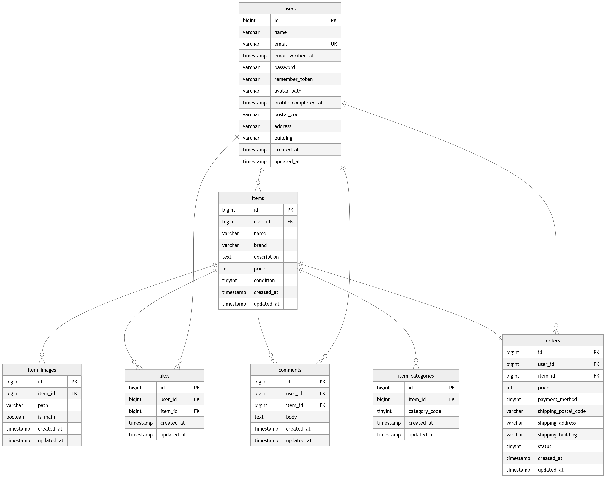

# coachtechフリマ

本アプリケーションは、商品の出品・購入を行うフリマアプリです。  
一般ユーザーは会員登録・ログイン後に商品を閲覧し、いいね・コメント・購入・出品・プロフィール編集を行うことができます。

---

## 【 環境構築 】
本アプリケーションは、Dockerを利用して環境構築を行います。

#### 1-1. リポジトリを取得

任意の作業ディレクトリで以下を実行してください。

```bash
git clone <リポジトリURL>
cd FurimaApp
```

#### 1-2. Laravelアプリの配置場所

Laravelアプリ本体は`src`配下にあるため、環境変数設定やArtisanコマンドは`src`を基準に実行します。

#### 2-1. `src`配下で`.env`を作成

```bash
cd src
cp .env.example .env
```

#### 2-2. `.env` のDB設定

`.env` に以下を設定してください。

```env
DB_CONNECTION=mysql
DB_HOST=mysql
DB_PORT=3306
DB_DATABASE=laravel_db
DB_USERNAME=laravel_user
DB_PASSWORD=laravel_pass
```

#### 2-3. `.env` に Stripe のAPIキーを設定

Stripe Checkout を利用するため、`src/.env` に Stripe のAPIキーを設定してください。

Stripe のAPIキーは、Stripeダッシュボードから取得できます。

1. [Stripe公式サイト](https://stripe.com/jp) にアクセスし、右上の「サインイン」からStripeダッシュボードにログインします。アカウントを未作成の場合は、先に新規登録を行ってください
2. ダッシュボードでテストモードを有効にします
3. 「開発者」→「APIキー」を開きます
4. 公開可能キー `pk_test_...` と 秘密キー `sk_test_...` を確認します

```env
STRIPE_PUBLIC=pk_test_xxxxx
STRIPE_SECRET=sk_test_xxxxx
```

- `STRIPE_PUBLIC` には公開可能キーを設定します
- `STRIPE_SECRET` には秘密キーを設定します
- 開発環境では `pk_test_...` / `sk_test_...` を使用してください
- `.env.example` には実際のキーを書かず、空欄のまま共有してください

#### 3-1. プロジェクトルートへ戻る

コンテナ操作はプロジェクトルートで行うため、一度`FurimaApp`直下へ戻ってから実行します。

```bash
cd ..
```

#### 3-2. コンテナの起動とLaravelセットアップ

```bash
# コンテナ起動
docker compose up -d --build

# Laravel依存関係のインストール
docker compose exec php bash -c "cd /var/www && composer install"

# storage/cache の書き込み権限調整
docker compose exec php bash -c "cd /var/www && chown -R www-data:www-data storage bootstrap/cache && chmod -R 775 storage bootstrap/cache"

# アプリケーションキー生成
docker compose exec php bash -c "cd /var/www && php artisan key:generate"

# 設定キャッシュクリア
docker compose exec php bash -c "cd /var/www && php artisan config:clear && php artisan cache:clear"

# マイグレーション・シーディング
docker compose exec php bash -c "cd /var/www && php artisan migrate:fresh --seed"

# storageシンボリックリンク作成
docker compose exec php bash -c "cd /var/www && php artisan storage:link"
```

※ 既存のローカル環境を流用して動作確認する場合は、以前のコンテナ・DB・キャッシュの状態により、最新のコードやマイグレーション、Seederの内容と不整合が起きることがあります。うまく動作しない場合は、コンテナの再構築と `php artisan migrate:fresh --seed` を実行してください。

---

## 【 使用技術 】
- 言語:PHP 8.1
- フレームワーク:Laravel 8.83
- DB:MySQL 8.0.26
- Webサーバ:nginx 1.21.1
- 認証:Laravel Fortify
- 決済:Stripe Checkout
- 仮想環境:Docker / Docker Compose
- フロントビルド:Laravel Mix
- テスト:PHPUnit

---

## 【 ER図 】



---

## 【 画面遷移図 】

### 利用者側（未ログイン時）

```text
  未ログイン
    ├─ PG01商品一覧画面 (/)
    │    ├─ PG02商品一覧画面_マイリスト
    │    │    └─ 未ログイン時は空表示
    │    ├─ キーワード検索
    │    └─ PG05商品詳細画面 (/item/{item_id})
    │         ├─ 会員登録画面へ遷移 (/register)
    │         ├─ ログイン画面へ遷移 (/login)
    │         ├─ いいね押下
    │         │    └─ ログイン画面へ遷移
    │         ├─ コメント送信
    │         │    └─ ログイン画面へ遷移
    │         └─ 購入手続きへ
    │              └─ ログイン画面へ遷移
    ├─ PG03会員登録画面 (/register)
    │    └─ 会員登録処理
    │         └─ メール認証案内画面 (/email/verify)
    └─ PG04ログイン画面 (/login)
         └─ ログイン成功
              ├─ 未認証: メール認証案内画面 (/email/verify)
              └─ 認証済み: 商品一覧画面 または 遷移元画面
```

### 利用者側（ログイン済み・認証済み）

```text
  ログイン済み
    ├─ PG01商品一覧画面 (/)
    │    ├─ PG02商品一覧画面_マイリスト (/?tab=mylist)
    │    ├─ キーワード検索
    │    └─ PG05商品詳細画面 (/item/{item_id})
    │         ├─ いいね追加 / 解除
    │         ├─ コメント投稿
    │         └─ PG06商品購入画面 (/purchase/{item_id})
    │              ├─ 支払い方法選択
    │              ├─ PG07送付先住所変更画面 (/purchase/address/{item_id})
    │              │    └─ 更新後、購入画面へ戻る
    │              ├─ 購入処理
    │              │    └─ Stripe Checkout画面へ遷移
    │              └─ 購入完了
    │                   └─ 商品一覧画面へ遷移
    ├─ PG08商品出品画面 (/sell)
    │    ├─ 商品画像選択
    │    ├─ カテゴリ選択
    │    ├─ 商品状態選択
    │    ├─ 商品情報入力
    │    └─ 出品完了
    │         └─ 商品一覧画面へ遷移
    └─ PG09プロフィール画面 (/mypage)
         ├─ PG12出品した商品一覧 (/mypage または /mypage?page=sell)
         ├─ PG11購入した商品一覧 (/mypage?page=buy)
         └─ PG10プロフィール編集画面 (/mypage/profile)
              └─ 更新完了
                   └─ プロフィール画面へ遷移
```

### 補足事項

- 会員登録後はメール認証を完了しないと主要機能は利用できません
- 商品購入と商品出品は、メール認証済みかつプロフィール入力完了後に利用できます
- 商品詳細画面では、自分が出品した商品に対して購入・いいね・コメントはできません
- 商品購入時は、送付先住所が未設定の場合に住所変更画面へ誘導されます
- ログイン画面・会員登録画面では、ヘッダーのロゴをクリックすると商品一覧画面へ遷移します（メール認証案内画面のロゴにはリンクを設定していません）
- 商品購入時の確認範囲は支払い方法ごとに異なります
- 購入ボタン押下後のStripe Checkout画面は、カード決済・コンビニ決済ともに別タブで開きます
- カード決済は即時決済のため、Stripeで決済後にアプリへ戻り、商品一覧画面へ遷移して「購入が完了しました」と表示されるところまでを確認対象とします
- コンビニ決済は遅延型決済のため、別タブでStripeのコンビニ支払い案内画面が表示されるところまでを確認対象とします
- コンビニ決済の入金後反映や注文状態管理は本課題の対象外です
- 出品時の価格バリデーションは0円以上となっているのに対し、購入時はStripe Checkoutの制約により、1円以上50円未満の商品は購入不可です（購入時に決済画面を作成できません）
- マイリスト画面は`tab=mylist`パラメータで切り替えています
- プロフィール画面の購入商品 / 出品商品は`page`パラメータで切り替えています

---

## 【 URL 】
- 商品一覧（トップ）:`http://localhost/`
- 会員登録:`http://localhost/register`
- ログイン:`http://localhost/login`
- 商品出品:`http://localhost/sell`
- マイページ:`http://localhost/mypage`
- phpMyAdmin:`http://localhost:8080/`
- MailHog:`http://localhost:8025/`

### URL利用時の注意

- ブラウザでの動作確認は`http://localhost`に統一してください
- `localhost`と`127.0.0.1`を混在させると、ブラウザ上で別サイトとして扱われ、ログインセッションが引き継がれない場合があります
- その結果、ログイン済みでもマイリストで「ログインが必要」と表示されたり、マイページ遷移時にログイン画面へ戻されたりすることがあります
- 会員登録、ログイン、メール認証、商品一覧、マイページ、MailHogの確認まで、同一ブラウザで`localhost`に統一して操作してください

---

## 【 主な機能 】

### 利用者側
- PG01: 商品一覧画面
- PG02: 商品一覧画面（マイリスト）
- PG03: 会員登録画面
- PG04: ログイン画面
- PG05: 商品詳細画面
- PG06: 商品購入画面
- PG07: 送付先住所変更画面
- PG08: 商品出品画面
- PG09: プロフィール画面
- PG10: プロフィール編集画面
- PG11: プロフィール画面_購入した商品
- PG12: プロフィール画面_出品した商品

### 実装済み機能
- 会員登録
- ログイン / ログアウト
- メール認証
- 商品一覧表示
- マイリスト表示
- 商品名検索
- 商品詳細表示
- いいね機能
- コメント投稿機能
- 商品購入機能
- 送付先住所変更機能
- プロフィール表示 / 編集
- 商品出品機能

---

## 【 認証（ログイン / 会員登録） 】
本アプリの認証には、Fortifyをベースに独自UI・バリデーションでカスタマイズしています。

- 会員登録後はメール認証画面へ遷移
- 未認証ユーザーはログイン後にメール認証画面へ遷移
- メール認証完了後はプロフィール編集画面へ遷移

---

## 【 Requestの利用箇所一覧 】

| Request名 | 役割 | 使用される場所 |
|-----------|------|----------------|
| `RegisterRequest` | 会員登録時のバリデーション | `CreateNewUser`（Fortifyユーザー登録処理） |
| `LoginRequest` | ログイン時のバリデーション | `FortifyServiceProvider` → Fortify Login |
| `CommentRequest` | コメント投稿バリデーション | `CommentController@store` |
| `PurchaseRequest` | 購入時の支払い方法バリデーション | `PurchaseController@purchase` |
| `AddressRequest` | 送付先住所変更バリデーション | `PurchaseController@updateAddress` |
| `ProfileRequest` | プロフィール更新バリデーション | `ProfileController@update` |
| `ExhibitionRequest` | 商品出品バリデーション | `ItemController@storeImage` |

---

## 【 画面一覧 】

| 画面ID | 画面名称 | パス |
|---|---|---|
| PG01 | 商品一覧画面(トップ画面) | `/` |
| PG02 | 商品一覧画面(トップ画面)_マイリスト | `/?tab=mylist` |
| PG03 | 会員登録画面 | `/register` |
| PG04 | ログイン画面 | `/login` |
| PG05 | 商品詳細画面 | `/item/{item_id}` |
| PG06 | 商品購入画面 | `/purchase/{item_id}` |
| PG07 | 送付先住所変更画面 | `/purchase/address/{item_id}` |
| PG08 | 商品出品画面 | `/sell` |
| PG09 | プロフィール画面 | `/mypage` |
| PG10 | プロフィール編集画面 | `/mypage/profile` |
| PG11 | プロフィール画面_購入した商品 | `/mypage?page=buy` |
| PG12 | プロフィール画面_出品した商品 | `/mypage?page=sell` |

---

## 【 テストアカウント 】

Seeder実行後、以下のユーザーでログイン確認ができます。

| 役割 | メールアドレス | パスワード | 補足 |
|---|---|---|---|
| テスト出品者ユーザー | `u1@test.com` | `password1` | メール認証済み / プロフィール完了済み |
| テスト購入者ユーザー | `u2@test.com` | `password2` | メール認証済み / プロフィール完了済み |
| テストアクティブユーザー | `u3@test.com` | `password3` | メール認証済み / プロフィール完了済み |
| テスト未認証ユーザー | `u4@test.com` | `password4` | メール認証未完了 |
| テストプロフィール未完了ユーザー | `u5@test.com` | `password5` | メール認証済み / プロフィール未完了 |

---

## 【 データベース 】

現行実装の主テーブルは以下です。

- `users`
- `items`
- `item_images`
- `likes`
- `comments`
- `orders`
- `item_categories`

---

## 【 テスト 】

ローカルのPHP 8.5では依存関係との相性差分があるため、Docker上のPHP 8.1で実行する想定です。

### 全体テスト

```bash
docker compose exec php php artisan test
```

### 実行確認済み結果

- 全体テスト:`44 passed`
- 商品詳細関連テスト: 成功
- 出品関連テスト: 成功
- 購入関連テスト: 成功

---

## 【 トラブルシューティング 】

### 1. `storage` / `bootstrap/cache` の書き込み権限エラーが出る場合

セットアップ後に権限エラーが発生した場合は、以下を再実行してください。

```bash
docker compose exec php bash
chown -R www-data:www-data storage bootstrap/cache
chmod -R 775 storage bootstrap/cache
```

### 2. ローカルの`php artisan test`が失敗する場合

ローカルのPHP 8.5環境では、Laravel 8系依存との非互換でテストが失敗することがあります。  
その場合はDocker上のPHP 8.1を利用してください。

```bash
docker compose exec php php artisan test
```

### 3. メール認証の確認

メール認証はMailHogで確認できます。

- MailHog:`http://localhost:8025/`

---

## 【 備考 】

- 設計書の画面パスに合わせて、商品系ルートパラメータは`{item_id}`に統一済みです
- 商品購入と商品出品にはプロフィール入力完了が必要です
- ER図は提出時に別途添付してください
